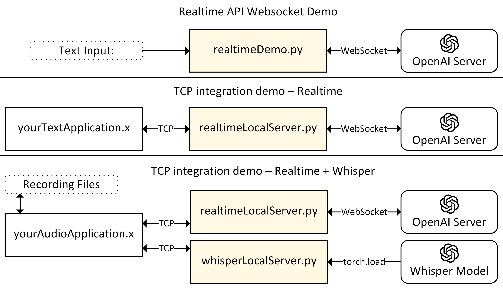

# OpenaiPythonIntegration
Example application code for integrating OpenAI Python API with Python- and non-Python-based applications. A more complete example application of this package being used with a Pepper robot for realtime verbal communication can be found here: [https://github.com/terzioglan/PepperDialogue](https://github.com/terzioglan/PepperDialogue) 

The scripts here are intended to serve as demo applications for the `realtimeWebsocket` and `whisperLocal` modules inside [`./lib/`](./lib/).
The main purpose of these demos is to examplify how these modules can be used in conjunction with/without Python applications without/with using TCP connections. 

The summary of three demo scenarios are shown below.



# Setup
It is recommended to setup a (Anaconda) virtual environments. The provided environment file [`openai-env.yml`](/openai-env.yml) respectively.
To create this environment, run:
```bash
conda env create -f openai-env.yml
```

To activate the environment using the default environment and file names in this package, run,
```bash
conda activate openai-env
```

You will need to provide your OpenAI credentials to run the code here. To generate an api key, go to: https://platform.openai.com/settings/organization/api-keys

Then,
1. Activate your environment and set your OpenAI API key:
    ```bash
    conda activate openai-env
    ```
2. Set your environment variable with your API key:
    ```bash
    conda env config vars set OPENAI_API_KEY=your-api-key
    ```
3. Deactivate and reactivate your environment:
    ```bash
    conda deactivate
    conda activate openai-env
    ```
4. Feel free to edit the LLM prompt in [`config.py`](/config.py#L33)

# Demonstrations


## Realtime API WebSocket demo
To interact with the OpenAI Realtime servers through text, run
```bash
python realtimeDemo.py
```

If you use`MODALITIES = ["text"]` in [`config.py`](./config.py), this code only asks the server to generate text output, so it should be cheaper than trying it out on the [platform.openai.com](https://platform.openai.com).

## TCP integration demo - Realtime API Websocket 
`yourTextApplication` communicates with the `realtimeLocalServer` through the TCP port on your localhost, simulating a case where you may want to use multiple processes--which are not necessarily python processes--that will interact with the Realtime servers.

In a terminal window, start the Realtime local server process:
```bash
python realtimeLocalServer.py
```
In another terminal window, run your application:
```bash
python yourTextApplication.py
```

## TCP integration demo - Whisper transcription to Realtime API Websocket 
`yourAudioApplication` makes two localhost connections through two TCP ports.
It first communicates with the [`whisperLocalServer`](./whisperLocalServer.py) to transcribe an audio file from the [`RECORDINGS`](./yourAudioApplication.py#L7), and sends the transcription to [`realtimeLocalServer`](./realtimeLocalServer.py) to generate an LLM response.

In a terminal window, start the Whisper transcription local server process:
```bash
python whisperLocalServer.py
```
In another terminal window, start the Realtime local server process:
```bash
python realtimeLocalServer.py
```
On a third terminal, run your audio to response application,
```bash
python yourAudioApplication.py
```